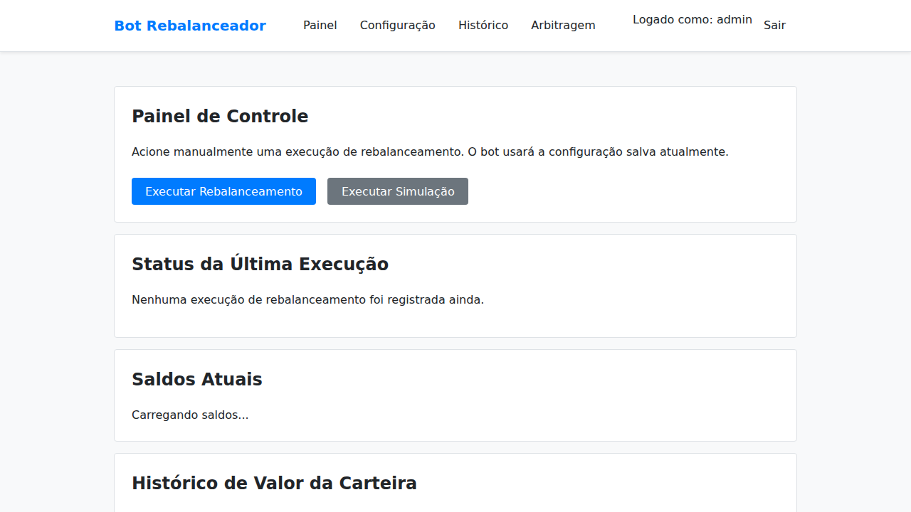
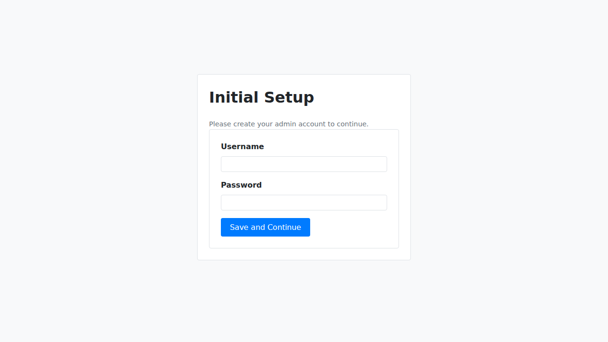
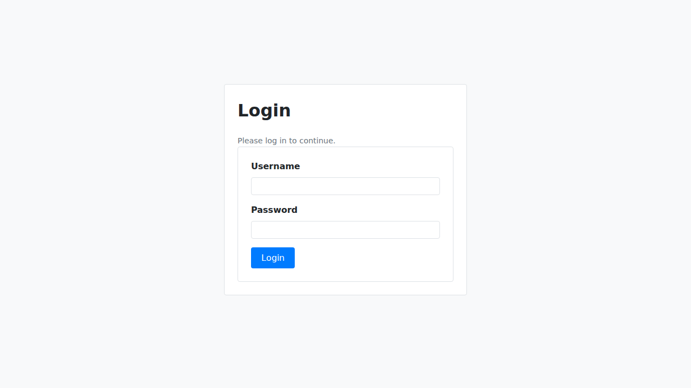
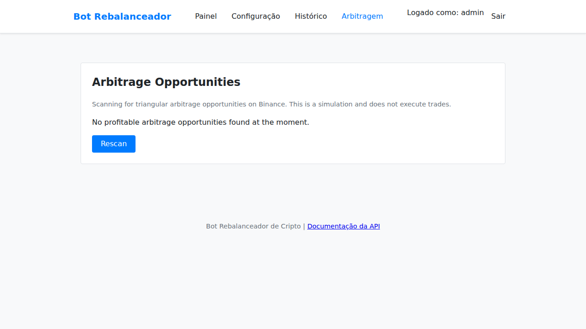

# Crypto Portfolio Rebalancing Bot



This repository contains a fully-featured, containerized bot to automatically rebalance your cryptocurrency portfolio on Binance. It also includes a tool to simulate triangular arbitrage opportunities.

It provides a simple, secure web interface for configuration, status monitoring, and manual control.

## Features

- **Secure First-Run Setup**: On the first launch, you are required to create a secure admin username and password.
- **JWT-Based Authentication**: The web UI is protected by a robust session management system.
- **Web UI**: Easy-to-use interface for all configuration, served directly from the container.
- **Arbitrage Simulator**: A dedicated page to scan for and display potential triangular arbitrage opportunities on Binance.
- **Flexible Rebalancing Strategies**: Rebalance periodically (e.g., every 24 hours) or when portfolio allocations drift past a configurable threshold.
- **Dry Run Mode**: Simulate rebalancing runs without executing any real trades to see the plan first.
- **Binance Integration**: Connects to your Binance account to read balances, get prices, and execute market orders.
- **CoinMarketCap Integration**: Filters your portfolio against top-ranked assets to avoid rebalancing low-quality or delisted coins.
- **Secure**: API keys are encrypted at rest using a master key. The bot never exposes your keys, not even in the UI.
- **Persistent**: All configuration and history are saved to a local `./data` directory, surviving container restarts.
- **Dockerized**: Runs in a single, lightweight Docker container for easy deployment.

---

## Screenshots

<table>
  <tr>
    <td align="center"><strong>Setup Page</strong></td>
    <td align="center"><strong>Login Page</strong></td>
  </tr>
  <tr>
    <td></td>
    <td></td>
  </tr>
  <tr>
    <td align="center"><strong>Dashboard</strong></td>
    <td align="center"><strong>Arbitrage Simulator</strong></td>
  </tr>
  <tr>
    <td></td>
    <td></td>
  </tr>
</table>

---

## 🛑 Security Warning

- **MASTER_KEY**: This application uses a `MASTER_KEY` to encrypt your API credentials. The first time you run the bot, a key will be generated in `data/secret.key`. You **MUST** back up this key. For any future deployments or if you move your `data` directory, you must provide this exact key as an environment variable to be able to decrypt your saved settings. **If you lose this key, you will have to re-enter all your credentials.**
- **HTTPS**: This application serves HTTP by default. Do not expose it directly to the internet. In a production environment, you should always run it behind a reverse proxy like Nginx or Traefik that provides TLS/SSL encryption (HTTPS).

---

## Getting Started

### Prerequisites

- [Docker](https://docs.docker.com/get-docker/)
- [Docker Compose](https://docs.docker.com/compose/install/)

### 1. Build and Run

With Docker running, execute the following command in your terminal:

```bash
docker-compose up --build
```
This will build the Docker image and start the container. **On the first run, you should run it without the `-d` flag** so you can see the logs.

### 2. Retrieve Your Master Key (First Run Only)

The first time you start the application, it will generate a unique, secret `MASTER_KEY` for you. This key is used to encrypt your API credentials.

Look for a message like this in the container logs:
```
================================================================================
!!! NEW MASTER KEY GENERATED !!!
...
MASTER_KEY: your_super_secret_and_long_encryption_key_here
================================================================================
```

**You must save this key.** For all future runs, you will need to provide it to the container.

### 3. Configure the Master Key for Future Runs

Stop the container (`Ctrl+C`).

Now, you need to provide the `MASTER_KEY` to the application for all future runs. The recommended way is to use a `.env` file.

Create a file named `.env` in the same directory as `docker-compose.yml` and add your key:
```env
# .env file
MASTER_KEY=your_super_secret_and_long_encryption_key_here
```

Now you can run the container in detached mode:
```bash
docker-compose up -d
```

### 4. Initial Application Setup

Once the container is running, open your web browser and navigate to:

**http://localhost:8080**

On your first visit, you will be redirected to the setup page to create your secure admin username and password.


After completing the setup, you will be redirected to the login page. Use your new credentials to log in.

---

## Usage

The web interface has four main sections:

- **Dashboard**: Shows the status of the last rebalance run, your current portfolio balances (with their approximate USD value), and allows you to manually trigger a live or dry run.
- **Configuration**: The main settings page. Here you can set your API keys, change your password, define your rebalancing strategy, set your target portfolio allocations, and more.
- **History**: Displays a table of all past rebalancing runs, whether they were successful, and what trades were made.
- **Arbitrage**: A simulator to find potential triangular arbitrage opportunities on Binance.

---

## Development

### Running Tests

To run the unit and integration tests, execute the following command from the root directory:

```bash
PYTHONPATH=src pytest
```

### API Documentation

The application provides automatic API documentation via Swagger UI and ReDoc. Once the application is running, you can access them at:
- **Swagger UI**: http://localhost:8080/docs
- **ReDoc**: http://localhost:8080/redoc

---

## Helper Scripts

The `scripts/` directory contains helper scripts for administrative tasks. They must be run from the root of the project directory.

- **`backup_db.sh`**: Creates a compressed, timestamped backup of your database file (`data/rebalancer.db`) and stores it in the `data/backups` directory. It also automatically prunes old backups, keeping the last 10.
  ```bash
  ./scripts/backup_db.sh
  ```

- **`reset_password.sh`**: Resets the admin password if you get locked out. This script must be run while the Docker container is running.
  ```bash
  ./scripts/reset_password.sh "your-new-secure-password"
  ```