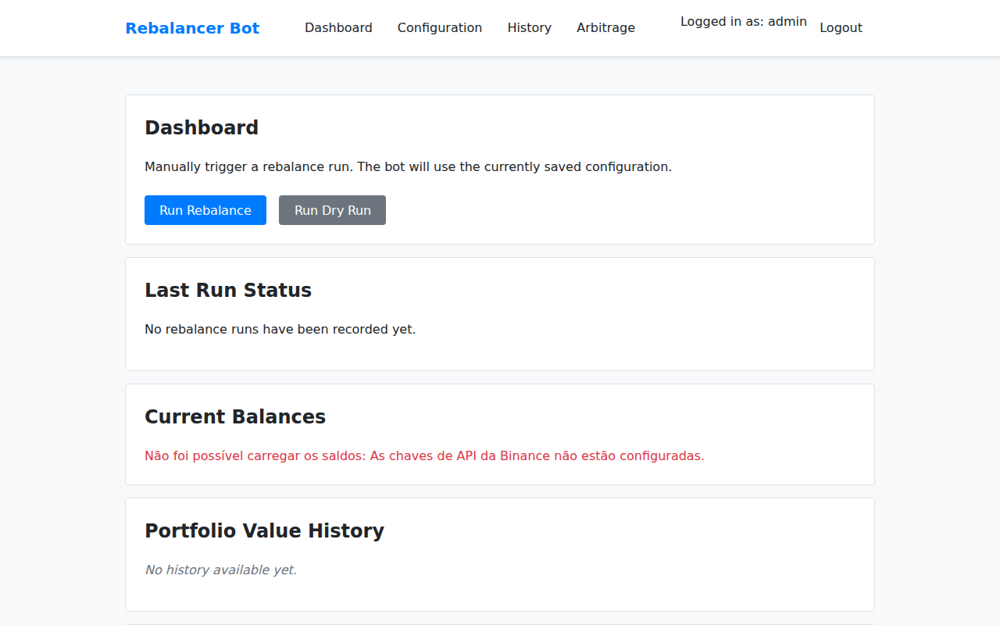
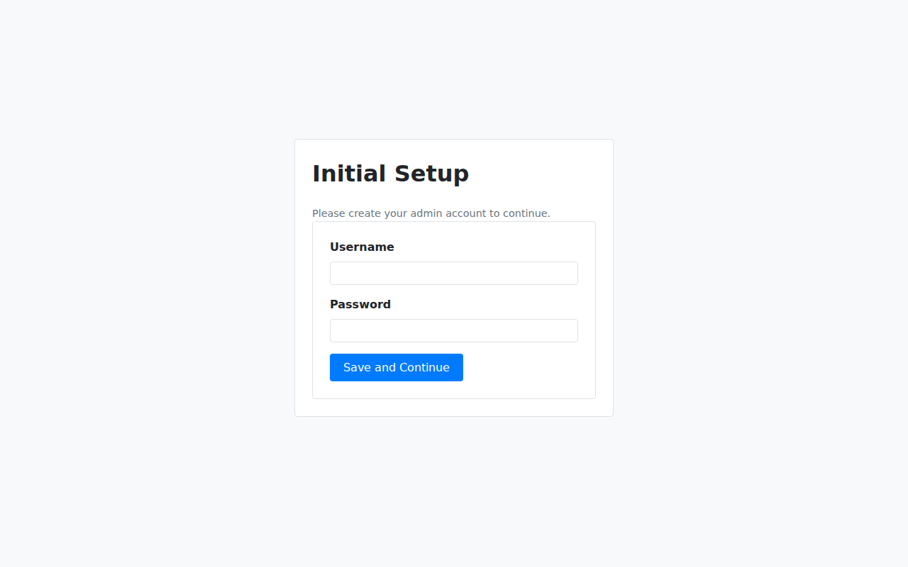
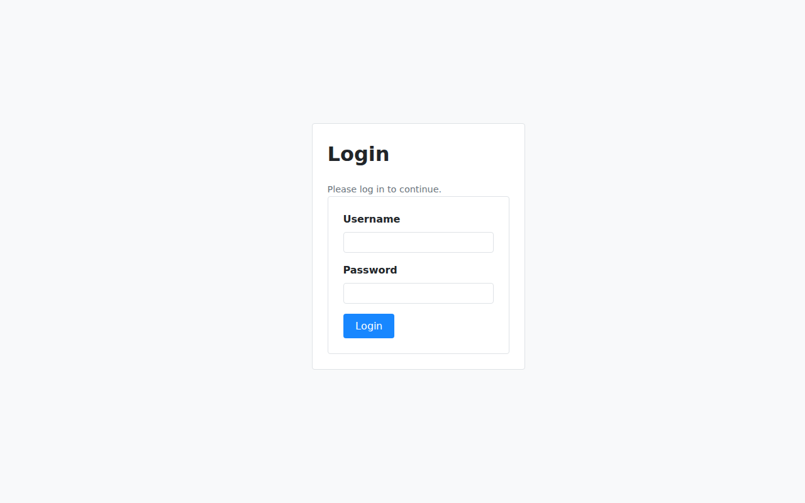
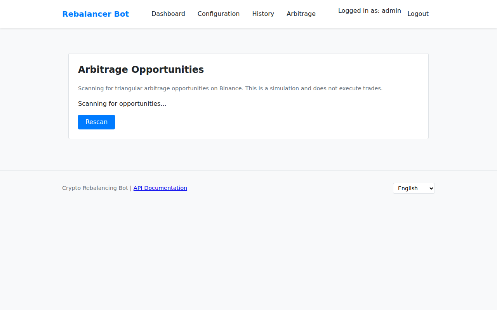

# Crypto Portfolio Rebalancing Bot



This repository contains a fully-featured, containerized bot to automatically rebalance your cryptocurrency portfolio on Binance. It prioritizes security, simplicity, and robustness.

## ✨ Key Features

- **Smart Rebalancing Engine**:
    - Automatically calculates the necessary trades to match your target allocations.
    - **Smart Liquidity Management**: Prioritizes SELL trades to free up capital before buying. If funds are tight (e.g., due to fees), it intelligently scales down BUY orders to maximize allocation without failing.
- **Secure by Design**:
    - **Encrypted Storage**: API keys are encrypted at rest using a master key.
    - **JWT Authentication**: Secure session management with HTTPOnly cookies.
    - **First-Run Setup**: Enforces a secure admin setup flow on first launch.
- **Interactive Web UI**:
    - **Dashboard**: View real-time portfolio value, current allocations, and status.
    - **Arbitrage Simulator**: Scan for triangular arbitrage opportunities on Binance.
    - **Configuration**: Easily update targets, API keys, and strategies.
- **Flexible Strategies**:
    - **Periodic**: Rebalance every N hours.
    - **Threshold**: Rebalance when an asset drifts by X%.
    - **Dry Run**: Simulate trades to verify logic without risking funds.
- **Dockerized**: Ready to deploy in minutes with Docker Compose.

---

## 📸 Screenshots

<div align="center">
  <table>
    <tr>
      <td align="center"><strong>Initial Setup</strong></td>
      <td align="center"><strong>Secure Login</strong></td>
    </tr>
    <tr>
      <td></td>
      <td></td>
    </tr>
    <tr>
      <td align="center"><strong>Dashboard</strong></td>
      <td align="center"><strong>Arbitrage Simulator</strong></td>
    </tr>
    <tr>
      <td></td>
      <td></td>
    </tr>
  </table>
</div>

---

## 🚀 Getting Started

### Prerequisites

- [Docker](https://docs.docker.com/get-docker/) & [Docker Compose](https://docs.docker.com/compose/install/)

### 1. Build and Run

```bash
docker-compose up --build
```
*Note: On the first run, keep the terminal open to see the generated Master Key.*

### 2. Secure Your Master Key

The application generates a `MASTER_KEY` on the first run to encrypt your data.

```
================================================================================
!!! NEW MASTER KEY GENERATED !!!
MASTER_KEY: gAAAAAB... (your key here)
================================================================================
```

**Save this key securely!** You must provide it as an environment variable for all future runs.

### 3. Production Mode

Create a `.env` file:
```env
MASTER_KEY=your_saved_key_here
```

Restart in detached mode:
```bash
docker-compose up -d
```

### 4. Access the UI

Navigate to **http://localhost:8080**. Complete the setup to create your admin account.

---

## 🛠 Development

To run tests locally:

```bash
# Install dependencies
mkdir .venv && pip install --target=.venv -r requirements.txt

# Run tests
PYTHONPATH=src:.venv pytest
```

---

## ❓ Troubleshooting

**"Invalid Token" or "Decryption Error"**
- Ensure the `MASTER_KEY` environment variable matches the one generated during the first run.
- If you lost the key, delete `data/config.json` and `data/secret.key` to reset (WARNING: This deletes all configuration).

**"Internal Server Error" on Arbitrage Page**
- Fixed in v1.1.1. Ensure you have the latest version.

**Trade Failed / Insufficient Funds**
- The bot now supports partial fills. If you see "Adjusting trade size" in the logs, the bot is working correctly to utilize all available dust.
